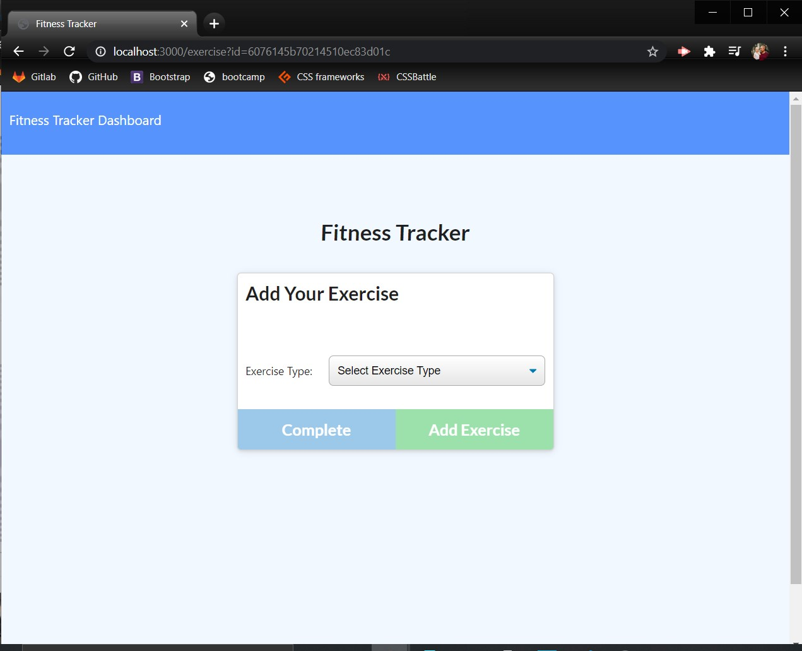
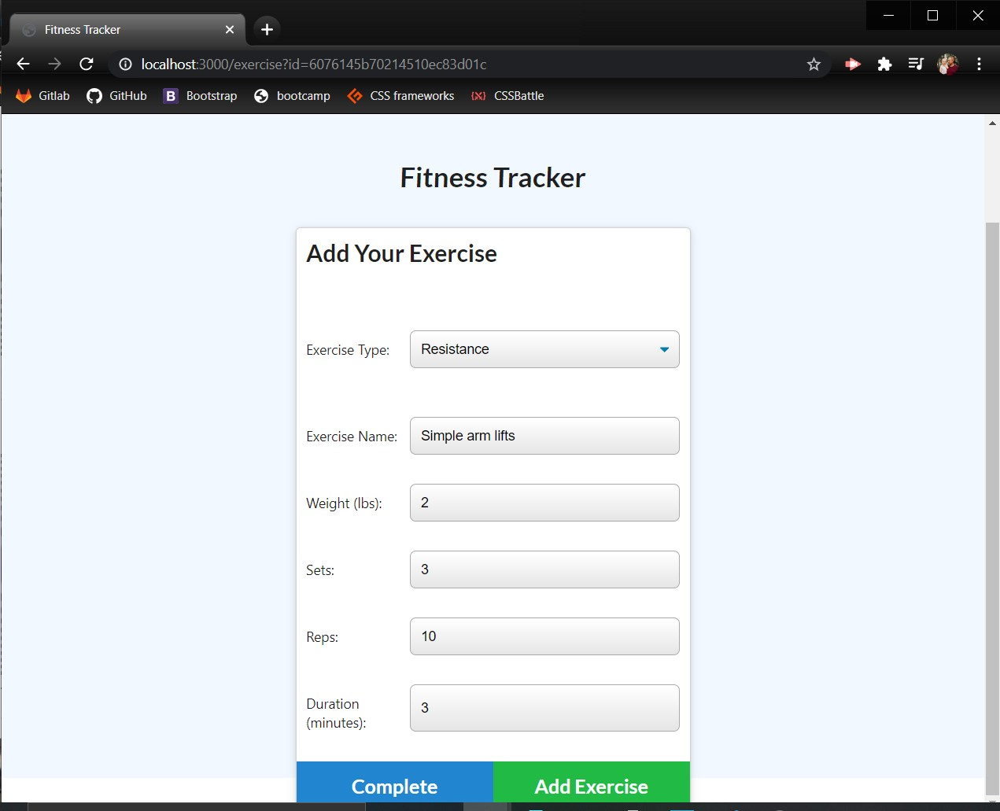
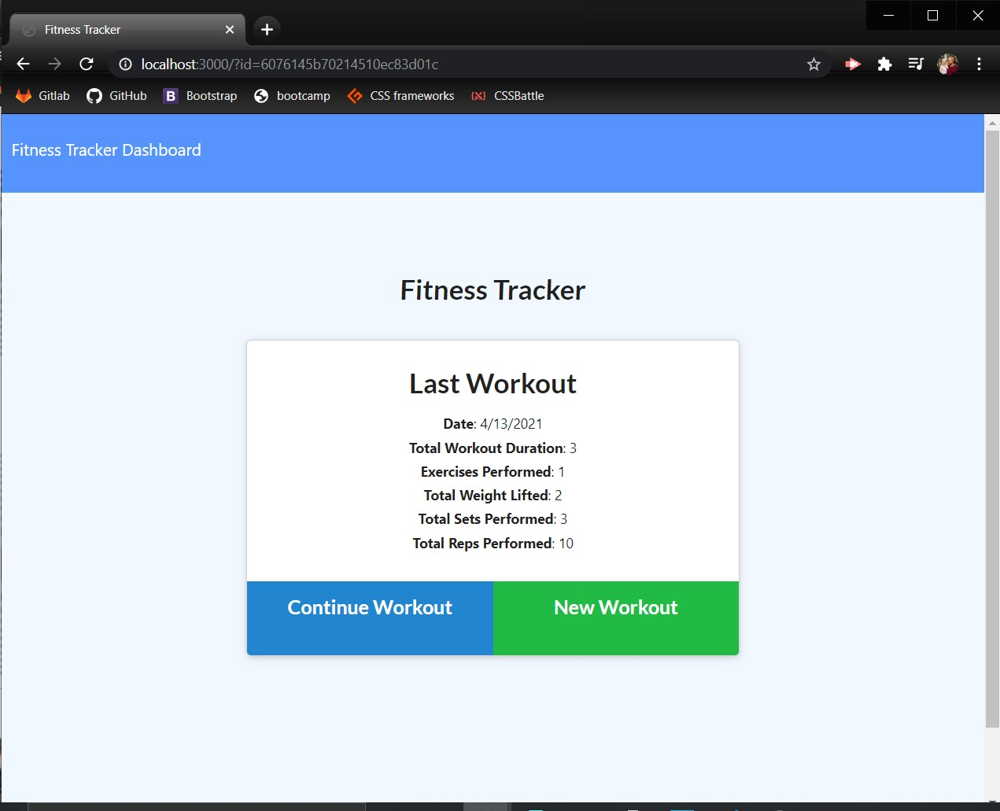
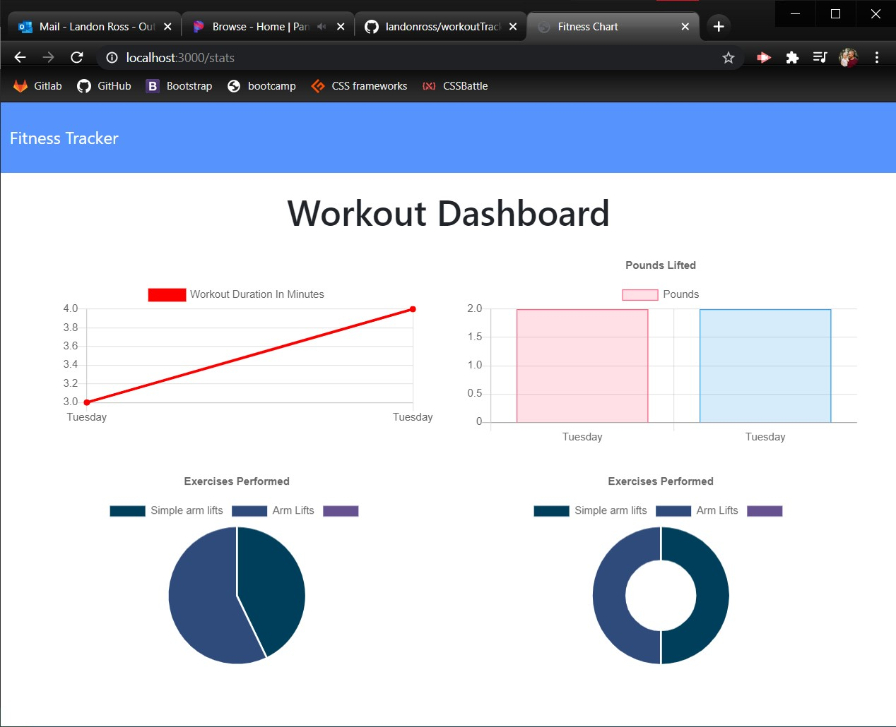

# Workout Tracker

Tracks workouts over the previous 7 days to help users view progress and types of exercises performed.

* [Installation](#Installation)

* [Instructions](#Instructions)

* [License](#License)

* [Contributors](#Contributors)

* [Author](#Author)

* [Tests](#Tests)

## Installation
will need to install the following through the terminal: 
* npm install
* npm install mongoose
* npm install express
* npm install morgan

## Instructions
Simply follow the directions on the page and the following questions to ensure all information is filed into the DB and stored for later use.

## License 
This project has the following license: MIT.

## Contributors
Landon Ross

## Tests
NA

## Questions
Please direct all questions to one of the following:

Email: landon.w.ross@gmail.com

GitHub: https://github.com/landonross
